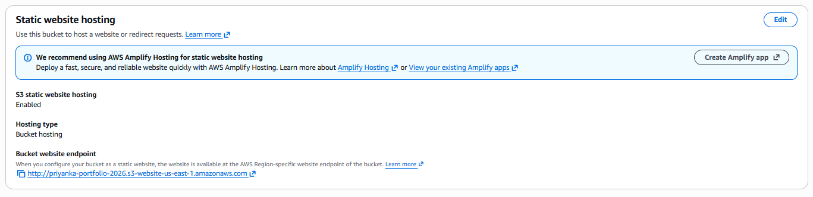
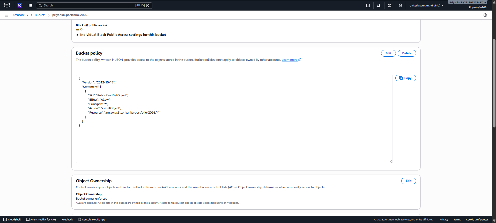
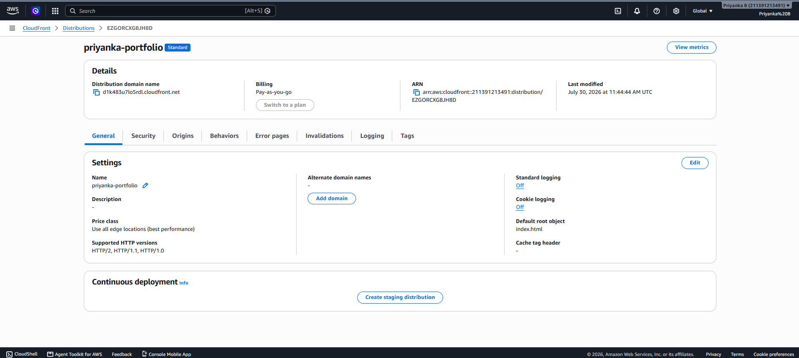
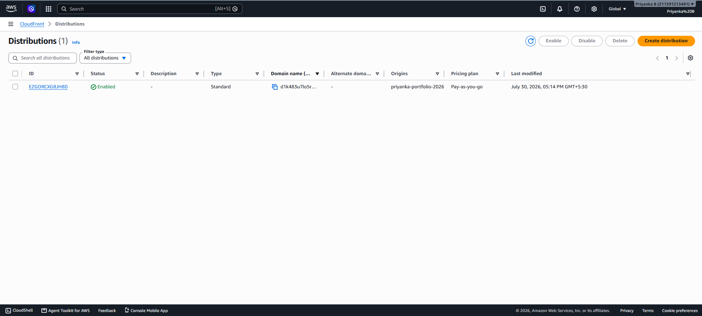
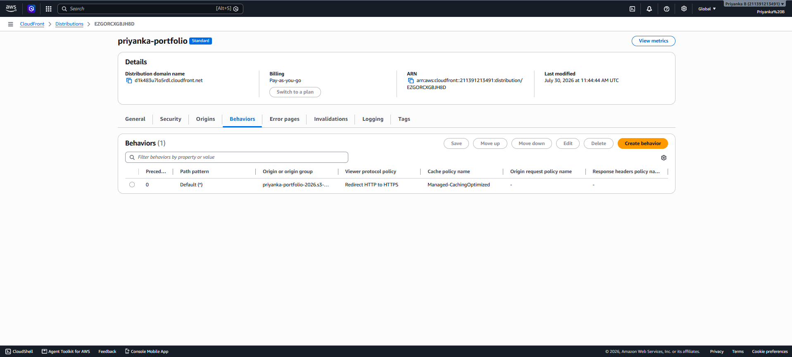
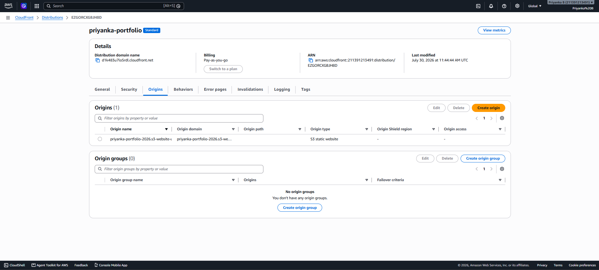
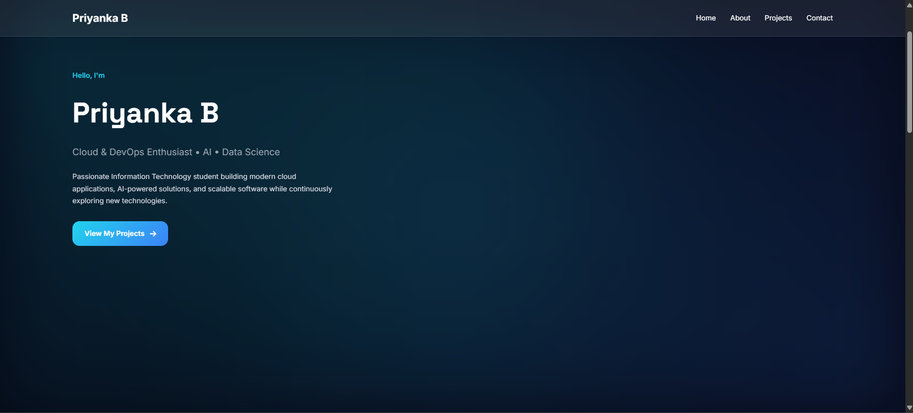

# Priyanka Portfolio

A responsive personal portfolio website built with HTML5 and CSS3, showcasing my projects, technical skills, and contact information. The portfolio is designed using a modern glassmorphism-inspired interface and is deployed as a static website on AWS.

## Live Demo

🔗 **Live Website:** https://d1k483u7lo5rdl.cloudfront.net

## Features

- Responsive design for desktop, tablet, and mobile devices
- Glassmorphism-inspired modern UI
- Semantic HTML5 structure
- Smooth navigation between sections
- Project showcase with screenshots
- Accessible images using descriptive alt text
- Clean and organized codebase

## Tech Stack

- HTML5
- CSS3
- Google Fonts
- Font Awesome
- Git & GitHub
- Amazon S3 (Static Website Hosting)
- Amazon CloudFront (HTTPS & CDN)

## Project Structure

```text
.
├── assets/
│   ├── analytics-dashboard.png
│   ├── gesture-control.png
│   └── research-agent.png
├── index.html
└── styles.css
```

## Running Locally

1. Clone the repository

```bash
git clone https://github.com/priyankabommani29-rgb/Priyanka-portfolio.git
```

2. Open the project folder.

3. Launch `index.html` in your browser, or use the **Live Server** extension in VS Code for a better development experience.

## AWS Deployment Steps

### Amazon S3

- [x] Create an S3 bucket
- [x] Enable Static Website Hosting
- [x] Upload portfolio files
- [x] Configure bucket policy for public read access (`s3:GetObject`)





Example deployment command:

```bash
aws s3 sync . s3://priyanka-portfolio-2026 --delete
```

### Amazon CloudFront

- [x] Create a CloudFront distribution
- [x] Select the S3 website endpoint as the origin
- [x] Enable HTTPS using **Redirect HTTP to HTTPS**
- [x] Set Default Root Object to `index.html`
- [x] Wait for deployment
- [x] Test the CloudFront URL









### Amazon S3

- [ ] Create an S3 bucket
- [ ] Enable Static Website Hosting
- [ ] Upload portfolio files
- [ ] Configure bucket policy for public access (if required)

Example deployment command:

```bash
aws s3 sync . s3://<your-bucket-name> --delete
```

### Amazon CloudFront

- [ ] Create a CloudFront distribution
- [ ] Select the S3 bucket as the origin
- [ ] Enable HTTPS
- [ ] Wait for deployment
- [ ] Test the CloudFront URL

## Git Workflow

```bash
git init
git add .
git commit -m "Initial portfolio structure"
git remote add origin https://github.com/priyankabommani29-rgb/Priyanka-portfolio.git
git branch -M main
git push -u origin main
```

## Screenshots

**Home Page**
The deployed portfolio homepage showcasing the hero section, navigation, and call-to-action buttons.



## Author

**Priyanka B**

GitHub: https://github.com/priyankabommani29-rgb
