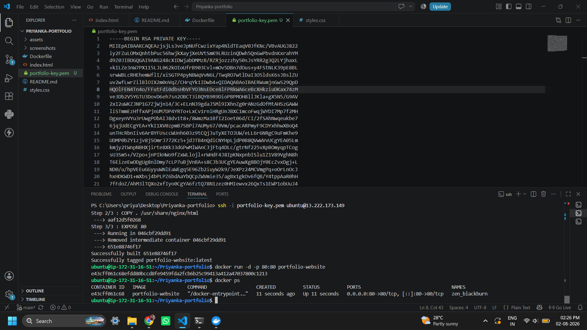
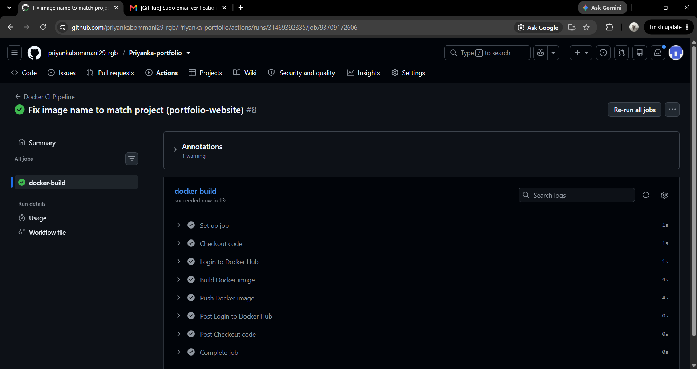

# Priyanka Portfolio

A responsive personal portfolio website built with HTML5 and CSS3, showcasing my projects, technical skills, and contact information. The portfolio is designed using a modern glassmorphism-inspired interface and is deployed as a static website on AWS.


---

# Task 1: Static Hosting on AWS S3 + CloudFront

## Live Demo

🔗 **Live Website:** https://d1k483u7lo5rdl.cloudfront.net

## Features

- Responsive design for desktop, tablet, and mobile devices
- Glassmorphism-inspired modern UI
- Semantic HTML5 structure
- Smooth navigation between sections
- Project showcase with screenshots
- Accessible images using descriptive alt text
- Clean and organized codebase

## Tech Stack

- HTML5
- CSS3
- Google Fonts
- Font Awesome
- Git & GitHub
- Amazon S3 (Static Website Hosting)
- Amazon CloudFront (HTTPS & CDN)

## Project Structure

```text
.
├── assets/
│   ├── analytics-dashboard.png
│   ├── gesture-control.png
│   └── research-agent.png
├── index.html
└── styles.css
```

## Running Locally

1. Clone the repository

```bash
git clone https://github.com/priyankabommani29-rgb/Priyanka-portfolio.git
```

2. Open the project folder.

3. Launch `index.html` in your browser, or use the **Live Server** extension in VS Code for a better development experience.

## AWS Deployment Steps

### Amazon S3

- [x] Create an S3 bucket
- [x] Enable Static Website Hosting
- [x] Upload portfolio files
- [x] Configure bucket policy for public read access (`s3:GetObject`)


Example deployment command:

```bash
aws s3 sync . s3://priyanka-portfolio-2026 --delete
```

### Amazon CloudFront

- [x] Create a CloudFront distribution
- [x] Select the S3 website endpoint as the origin
- [x] Enable HTTPS using **Redirect HTTP to HTTPS**
- [x] Set Default Root Object to `index.html`
- [x] Wait for deployment
- [x] Test the CloudFront URL


## Git Workflow

```bash
git init
git add .
git commit -m "Initial portfolio structure"
git remote add origin https://github.com/priyankabommani29-rgb/Priyanka-portfolio.git
git branch -M main
git push -u origin main
```

## Screenshots

**Home Page**
The deployed portfolio homepage showcasing the hero section, navigation, and call-to-action buttons.


---

# Task 2: Containerization Using Docker + Cloud VM Deployment

This task extends the portfolio from Task 1 by packaging it into a Docker container running Nginx, then deploying that container onto an AWS EC2 virtual machine — accessible via a public IP address.

## Live Deployment (Task 2)

🔗 **Public IP:** http://13.222.173.149

## Additional Tech Stack

- Docker
- Nginx (via `nginx:alpine` base image)
- AWS EC2 (Ubuntu 26.04 LTS, t3.micro)

## Dockerfile

```dockerfile
FROM nginx:alpine
COPY . /usr/share/nginx/html
EXPOSE 80
```

**Why these three instructions:**
- `FROM nginx:alpine` — uses a minimal, pre-built web server image (~30MB total) instead of building a server from scratch
- `COPY . /usr/share/nginx/html` — copies the portfolio files into Nginx's default web root, so they're served automatically
- `EXPOSE 80` — documents that the container serves traffic on port 80 (the standard HTTP port)

## Local Docker Steps

```bash
# Build the image
docker build -t portfolio-website .

# Run the container locally (mapped to host port 8081 to avoid conflicts)
docker run -d -p 8081:80 portfolio-website
```

Visit `http://localhost:8081` to test locally before deploying.

## Cloud VM Deployment Steps

### 1. Launch an EC2 instance
- AMI: Ubuntu 26.04 LTS (Free tier eligible)
- Instance type: t3.micro (Free tier eligible)
- Security Group: allow SSH (22), HTTP (80), HTTPS (443) — least-privilege, only what's needed to manage and serve the site

### 2. Connect via SSH
```bash
ssh -i portfolio-key.pem ubuntu@13.222.173.149
```

### 3. Install Docker on the VM
```bash
sudo apt update
sudo apt install docker.io -y
sudo systemctl start docker
sudo systemctl enable docker
```

### 4. Allow Docker without sudo (optional but recommended)
```bash
sudo usermod -aG docker ubuntu
```
Log out and back in for this to take effect — avoids needing `sudo` before every Docker command.

### 5. Clone the repository onto the VM
```bash
git clone https://github.com/priyankabommani29-rgb/Priyanka-portfolio.git
cd Priyanka-portfolio
```

### 6. Build and run the container on the VM
```bash
docker build -t portfolio-website .
docker run -d -p 80:80 portfolio-website
```

### 7. Verify

```bash
docker ps
```



Then visit the public IP directly in a browser — no port number needed, since the container is mapped to port 80: http://13.222.173.149

## Issues Faced & Solutions

- **Local port 8080 conflict:** host port 8080 was already in use by another process; resolved by mapping to 8081 instead (`-p 8081:80`)
- **Docker permission denied on VM:** the `ubuntu` user wasn't in the `docker` group by default; fixed with `sudo usermod -aG docker ubuntu` followed by re-login
- **t2.micro not free-tier eligible on this account:** used `t3.micro` instead, which is functionally equivalent for this workload and confirmed free-tier eligible

---

---

# Task 3: CI/CD Automation for Dockerized Applications Using GitHub Actions

This task automates the Docker build-and-push process from Task 2 using GitHub Actions — every push to `main` automatically builds a fresh Docker image and publishes it to Docker Hub, removing manual build steps and reducing human error.

## Docker Hub Image

🔗 **Image:** https://hub.docker.com/r/priyankab29/portfolio-website

```bash
docker pull priyankab29/portfolio-website:latest
```
## Versioned Tags

Every push builds and pushes **two tags**: `latest` (always the newest build) and the Git commit SHA (e.g., `6e59f5c...`), so any previous build remains individually retrievable even after `latest` is overwritten by a newer push.

```bash
docker pull priyankab29/portfolio-website:<commit-sha>
```

## Additional Tech Stack

- GitHub Actions
- Docker Hub
- YAML

## CI/CD Concept

- **CI (Continuous Integration):** automatically building the Docker image on every push, catching build issues immediately rather than manually
- **Scope of this task:** CI + image delivery only — the image is built and published automatically, but deployment to the EC2 VM (from Task 2) remains a manual `docker pull` + `docker run`, which is the natural next step for a future CD task

## Workflow File

`.github/workflows/docker-ci.yml`

```yaml
name: Docker CI Pipeline

on:
  push:
    branches:
      - main

jobs:
  docker-build:
    runs-on: ubuntu-latest

    steps:
      - name: Checkout code
        uses: actions/checkout@v4

      - name: Login to Docker Hub
        uses: docker/login-action@v3
        with:
          username: ${{ secrets.DOCKER_USERNAME }}
          password: ${{ secrets.DOCKER_PASSWORD }}

      - name: Build Docker image
        run: |
          docker build -t ${{ secrets.DOCKER_USERNAME }}/portfolio-website:latest .
          docker tag ${{ secrets.DOCKER_USERNAME }}/portfolio-website:latest ${{ secrets.DOCKER_USERNAME }}/portfolio-website:${{ github.sha }}

      - name: Push Docker image
        run: |
          docker push ${{ secrets.DOCKER_USERNAME }}/portfolio-website:latest
          docker push ${{ secrets.DOCKER_USERNAME }}/portfolio-website:${{ github.sha }}
```

**Why each step exists:**
- `Checkout code` — the runner starts as an empty VM; this pulls the repo's files onto it
- `Login to Docker Hub` — authenticates using GitHub Secrets (`DOCKER_USERNAME`, `DOCKER_PASSWORD`), never hardcoded credentials
- `Build Docker image` — same `docker build` command from Task 2, now run automatically
- `Push Docker image` — publishes the built image to Docker Hub, making it centrally available for deployment anywhere

## Secrets Configuration

Configured under **GitHub Repo → Settings → Secrets and variables → Actions**:
- `DOCKER_USERNAME` — Docker Hub username
- `DOCKER_PASSWORD` — Docker Hub **Access Token** (not the account password — tokens are scoped and revocable independently)

## Verifying the Pipeline

1. Push any change to `main`
2. Go to the repo's **Actions** tab to watch the workflow run
3. Confirm all four steps show green checkmarks
4. Confirm the new image appears on Docker Hub with an updated "last pushed" timestamp



## Issues Faced & Solutions

- **Secret name mismatch:** initial YAML referenced `DOCKERHUB_USERNAME`/`DOCKERHUB_TOKEN`, but the actual GitHub Secrets were named `DOCKER_USERNAME`/`DOCKER_PASSWORD` — mismatched names fail silently (resolve to empty values) rather than throwing a clear error. Fixed by aligning the YAML references exactly with the secret names.
- **Incorrect Docker Hub authentication:** initial token/credentials were rejected; resolved by regenerating a fresh Docker Hub Access Token and re-entering both secrets carefully.
- **Image name drift:** an intermediate edit accidentally hardcoded a different image name (`docker-ci-pipeline`) instead of `portfolio-website`; corrected to keep consistency with the project and Task 2's naming.

## Author

**Priyanka B**

GitHub: https://github.com/priyankabommani29-rgb
